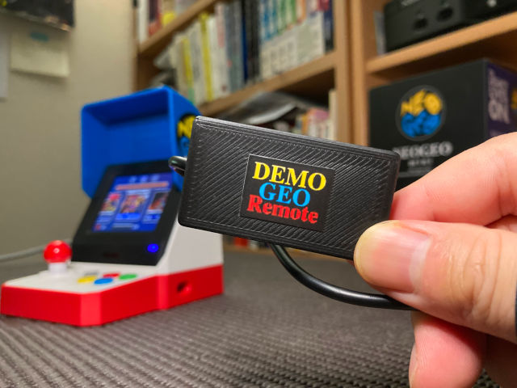

# demogeoRemote_SerialCtrl
### ネオジオミニに挿すだけでデモ機能を実現するUSBデバイス
  
### demogeoRemote（デモジオリモート）
  
### リモート機能でPythonからパッド操作も出来ます
  
[販売情報はこちらからご覧いただけます](https://amsss.hatenablog.com/entry/2024/10/07/184628).  
  
YouTubeショートにて商品紹介動画ご覧いただけます。
.

   
---
このリポジトリはdemogeoRemote（デモジオリモート）でリモート機能を利用するためのコードをまとめています。  
FT232RLのドライバのインストールが必要です。  
2024年12月下旬以降にご購入された本体はFT232RLからCH340Nに変更しています。  
  
---
[Twitterアカウントはこちらです](https://x.com/ukkari_6).  
